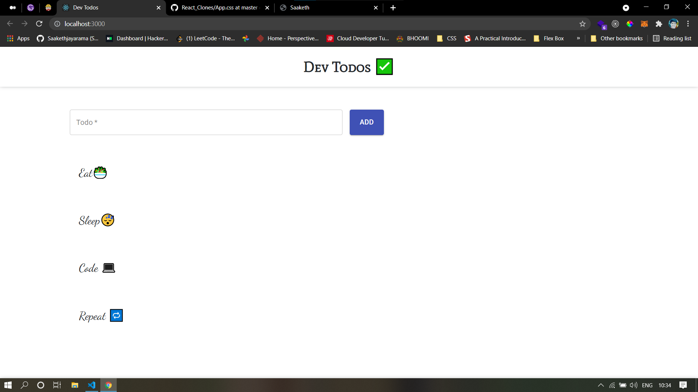

# Todo App

## Clone and Run

```
git clone https://github.com/Saakethjayarama/rf-todos.git
cd rf-todos
npm i
npm start
```

## This project demonstrates the usage of

1. React Hooks (useEffect, useState)
2. Material UI Button and TextBox
3. Bootstrap Modal
4. Material UI Snackbar
5. Firebase Realtime Database

# Screenshots


